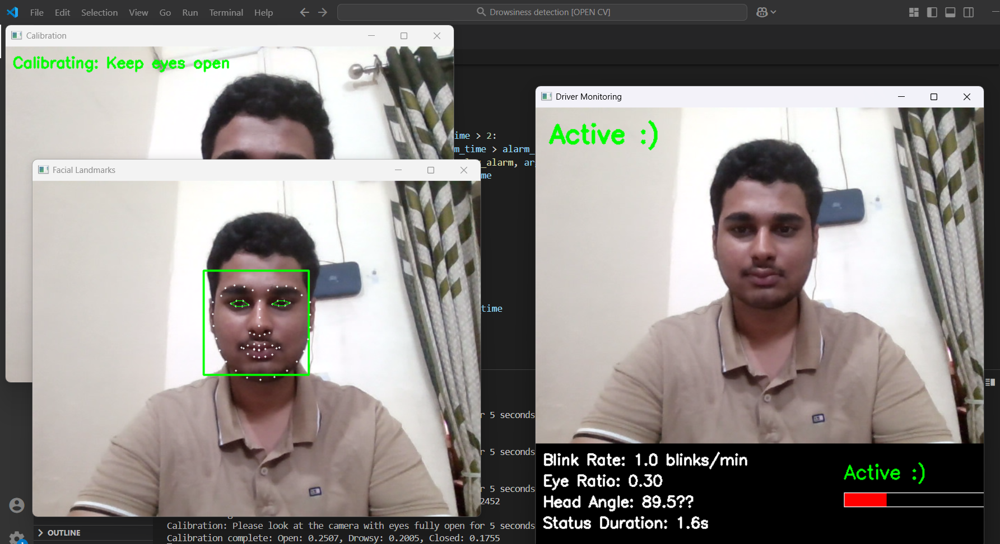
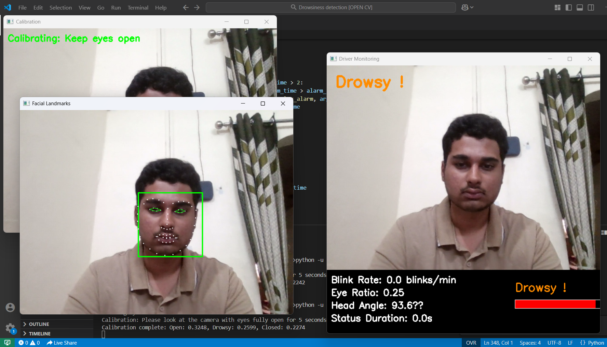

# Driver Drowsiness Detection System

A real-time computer vision system that monitors driver alertness by analyzing facial features to detect signs of drowsiness and prevent accidents.




## Table of Contents
- [Features](#features)
- [Requirements](#requirements)
- [Installation](#installation)
- [Usage](#usage)
- [How It Works](#how-it-works)
- [Configuration](#configuration)
- [Troubleshooting](#troubleshooting)

## Features

- **Real-time drowsiness detection** using eye aspect ratio and head position
- **Personalized calibration** to accommodate different eye shapes and sizes
- **Multi-level alerts** based on drowsiness severity
- **Visual dashboard** displaying eye ratio, head angle, and blink rate
- **Comprehensive logging** for analysis and improvement
- **Adaptable thresholds** for different lighting conditions
- **Audio alerts** to wake drivers when drowsiness is detected

## Requirements

- Python 3.6+
- OpenCV
- dlib
- NumPy
- imutils
- simpleaudio
- A webcam or camera

## Installation

### 1. Clone the repository

Download the project to your local machine.

### 2. Install required Python packages

```bash
pip install opencv-python numpy dlib imutils simpleaudio
```

### 3. Install dlib (detailed instructions)

Installing dlib can be challenging, especially on Windows. Here's a detailed guide:

#### Windows:
1. Install Visual Studio Build Tools with C++ development tools
   ```bash
   # Download and install from:
   # https://visualstudio.microsoft.com/visual-cpp-build-tools/
   ```

2. Install CMake
   ```bash
   pip install cmake
   ```

3. Install dlib
   ```bash
   pip install dlib
   ```

   If you encounter issues, try using a pre-built wheel:
   ```bash
   pip install https://github.com/jloh02/dlib/releases/download/v19.22/dlib-19.22.99-cp310-cp310-win_amd64.whl
   ```
   (Replace with the appropriate version for your Python)

#### Linux:
```bash
sudo apt-get update
sudo apt-get install build-essential cmake
sudo apt-get install libopenblas-dev liblapack-dev
sudo apt-get install libx11-dev libgtk-3-dev
pip install dlib
```

#### macOS:
```bash
brew install cmake
pip install dlib
```

### 4. Download the facial landmark predictor

The project requires the 68-point facial landmark predictor from dlib.

Download the model file from:
http://dlib.net/files/shape_predictor_68_face_landmarks.dat.bz2

Extract the file and place it in the project directory.

### 5. Prepare alarm sounds

The project uses three sound files for different alarm levels:
- gentle_alarm.wav (low intensity)
- medium_alarm.wav (medium intensity)
- alarm.wav (high intensity)

Place these files in the project directory.

## Usage

1. **Start the application**:
   ```bash
   python driver_drowsiness.py
   ```

2. **Initial Calibration**:
   - Upon startup, the system will enter calibration mode
   - Look directly at the camera with your eyes fully open
   - Stay still for 5 seconds to complete calibration

3. **Monitoring**:
   - The system will now track your eyes and head position
   - Dashboard will display all metrics in real-time
   - Status will change between "Active", "Drowsy", and "SLEEPING"

4. **Controls**:
   - Press 'r' to recalibrate the system
   - Press 'ESC' to exit the application

5. **After usage**:
   - Check the logs folder for detailed session data
   - CSV files contain timestamps, measurements, and status changes

## How It Works

The system works by:

1. **Detecting facial landmarks** using dlib's predictor
2. **Calculating eye aspect ratio (EAR)** by measuring distances between eye landmarks
3. **Monitoring head position** to detect nodding or tilting
4. **Combining measurements** into a drowsiness score
5. **Tracking blink rate** as an additional indicator
6. **Triggering alerts** when drowsiness is detected for several consecutive frames

### Eye Aspect Ratio (EAR)

The primary detection method uses the ratio of eye openness:
- EAR = (d1 + d2) / (2 * d3)
  - d1, d2 = vertical distances between eye landmarks
  - d3 = horizontal distance between eye landmarks

### Drowsiness States

The system defines three states:
- **Active**: Normal eye movement and head position
- **Drowsy**: Partially closed eyes or head tilting
- **Sleeping**: Closed eyes or significant head movement

## Configuration

You can modify these parameters in the code to customize the system:

- `alarm_interval`: Time between consecutive alarms (seconds)
- `eye_open_ratio`: Threshold for fully open eyes (calibrated automatically)
- `eye_drowsy_ratio`: Threshold for drowsy state (calibrated automatically)
- Frame skip settings for performance on slower systems

## Troubleshooting

### Common Issues:

1. **dlib installation errors**:
   - Follow the detailed installation steps for your OS
   - Try using pre-built wheels
   - Ensure Visual Studio Build Tools are correctly installed (Windows)

2. **False positive detections**:
   - Recalibrate the system using the 'r' key
   - Ensure good, consistent lighting
   - Adjust the eye ratio thresholds for your specific eyes

3. **Camera not working**:
   - Check if another application is using the camera
   - Verify camera permissions
   - Try changing the camera index in the code (`cv2.VideoCapture(0)`)

4. **Sound alerts not working**:
   - Ensure audio files are in the correct location
   - Check if simpleaudio is properly installed
   - Verify system audio is working

5. **Small eyes detection issue**:
   - For people with naturally smaller eyes, the system might show "drowsy" even when fully awake
   - Press 'r' to recalibrate with eyes fully open
   - The system will adjust thresholds accordingly


## Acknowledgements

- Dlib library for facial landmark detection
- OpenCV for computer vision capabilities

